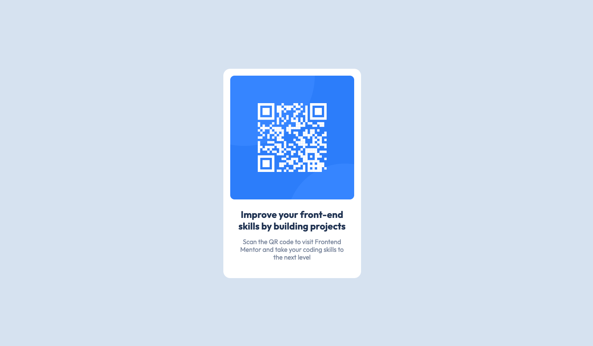

# Frontend Mentor - QR code component solution

This is a solution to the [QR code component challenge on Frontend Mentor](https://www.frontendmentor.io/challenges/qr-code-component-iux_sIO_H). Frontend Mentor challenges help you improve your coding skills by building realistic projects.

## Table of contents

- [Overview](#overview)
  - [Screenshot](#screenshot)
  - [Links](#links)
- [My process](#my-process)
  - [Built with](#built-with)
  - [What I learned](#what-i-learned)
  - [Continued development](#continued-development)
  - [Useful resources](#useful-resources)
- [Author](#author)

## Overview

### Screenshots

Mobile Design


Desktop Design


### Links

- Solution URL: [https://kennbach.github.io/qr-code-component/](https://kennbach.github.io/qr-code-component/)

## My process

### Built with

- Semantic HTML5 markup
- CSS Variables
- CSS Grid
- Mobile-first workflow
- Accessibility Aware

### What I learned

While developing this app I learned that the color scheme triggered an accessibility warning for text contrast. Not wanting to stray from the restrictions of the project's design file, I left them as is, but noted that the designers should re-evaluate their color choices.

I also learned to change the root font-size from base-16 (16px) to base-10 (10px), making setting styles using `rem` much more intuitive, and fast. It is much easier to calculate what rem value would equal a size 15 font using base-10 (1.5rem) compared to base-16 (0.9375rem) simply by setting the root font-size to 62.5%, as shown below:

```css
:root {
  font-size: 62.5%;
  ...;
}
```

### Continued development

I started to learn more about accessibility on this project and the tools to help with the development and testing of accessible applications. I plan to keep this a focus during future app development projects.

### Useful resources

- [The Net Ninja: HTML & CSS Crash Course](https://youtube.com/playlist?list=PL4cUxeGkcC9ivBf_eKCPIAYXWzLlPAm6G) - This is a great resource to learn or refresh your HTML and CSS knowledge from the ground up.

- [The Net Ninja: CSS Variables](https://youtube.com/playlist?list=PL4cUxeGkcC9ii5PB2UMyYH7QFZWfGnVgZ) - This is a great resource to learn CSS variables.

- [The Net Ninja: CSS Grid](https://youtube.com/playlist?list=PL4cUxeGkcC9itC4TxYMzFCfveyutyPOCY) - This is a great resource to learn CSS grid.

- [Kevin Powell: Are you using the right CSS units?](https://youtu.be/N5wpD9Ov_To) - There are a lot of different units that we can use when writing CSS, in this video Kevin gives some general rules of thumb of which ones are best suited for which situations. This is also where I learned how to convert the root font-size to base-10.

- Both, [Kevin Powell](https://www.youtube.com/kepowob) and [The Net Ninja](https://www.youtube.com/c/TheNetNinja) have a virtual-ton of great web app development tutorials. I only listed a few above, but there are many, many more.

## Author

- Github - [kennbach](https://github.com/kennbach)
- Frontend Mentor - [@kennbach](https://www.frontendmentor.io/profile/kennbach)
